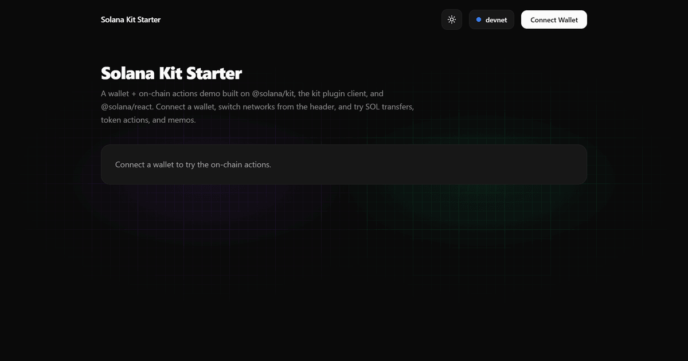

# VeloSplit — One Invoice for the Whole Team

> Create one team invoice and split a DEMOUSD payment directly among 2–5 wallets on Solana Devnet.

[Architecture](docs/architecture.md) · [Product overview](docs/product.md) · [API](docs/api.md) · [Roadmap](docs/roadmap.md)



---

## Project Overview

VeloSplit is a Devnet-only demo for teams that need to collect a single token payment and distribute agreed shares to several wallets. The payer approves one transaction; the client sends each recipient their share directly. The app does not custody funds, and DEMOUSD has no real-world value.

## Problem and Solution

### 1. Split payments require coordination

- **Problem:** A team collecting one payment across multiple wallets has to calculate shares and coordinate several transfers.
- **VeloSplit:** Creates one invoice with 2–5 named recipients and percentage shares that add up to 100%.

### 2. The payer needs a clear, verifiable payment

- **Problem:** A payer needs to know which token and recipients a payment covers.
- **VeloSplit:** Builds a single Devnet transaction that distributes the invoice token to the listed wallets, then verifies the transaction against the invoice on Devnet.

## Why Solana

- **Direct settlement:** SPL tokens can be transferred to each recipient in the same signed transaction.
- **Wallet support:** The app connects to wallets that implement Solana Wallet Standard.
- **Low-cost testing:** Devnet allows the demo flow to be exercised with test SOL and DEMOUSD.

## Summary of Features

- Create token invoices for 2–5 recipients.
- Set each recipient’s wallet and percentage share.
- Split a DEMOUSD payment in one payer-approved transaction.
- Verify payment details against Solana Devnet before marking an invoice paid.
- View invoices through a shareable invoice URL.
- Connect a Wallet Standard wallet and use Devnet.

## Tech Stack

| Layer | Technology |
| --- | --- |
| Frontend and API | TypeScript · React · Next.js 16 |
| Solana client | `@solana/kit` · Solana Wallet Standard |
| Token transfers | SPL Token program |
| Styling | Tailwind CSS 4 |
| Invoice storage | Local JSON file (`.data/invoices.json`) |

## Architecture

```text
┌─────────────────────┐       ┌────────────────────────┐
│ Payer's wallet      │──────▶│ VeloSplit Next.js app   │
│ signs one Devnet tx │       │ invoice UI + API routes │
└─────────────────────┘       └────────────┬───────────┘
                                           │ verify signature
                                           ▼
                                ┌────────────────────────┐
                                │ Solana Devnet RPC      │
                                └────────────────────────┘
```

The browser constructs and submits the token transfers. The API verifies the transaction signature and expected token transfers before updating the invoice record. See [the architecture notes](docs/architecture.md) for details.

## Quick Start

Prerequisites: Node.js 24 or later and npm.

```bash
git clone <your-repository-url>
cd VeloSplit/frontend
npm ci
npm run dev
```

Open <http://localhost:3000>. On Windows, run `scripts/start-dev.bat` from the repository root. On macOS or Linux, run `./scripts/start-dev.sh`.

For a demo, connect a wallet set to Devnet and use test SOL for network fees. Create or use a DEMOUSD test token, then create an invoice.

## Roadmap

- Replace local JSON invoice storage with durable shared storage before hosting the app on serverless infrastructure.
- Add invoice ownership and authentication.
- Add payment status refresh and recovery for delayed Devnet confirmations.
- Evaluate production safeguards before considering networks beyond Devnet.

See [the roadmap](docs/roadmap.md). These are potential follow-up items, not implemented features.

## Resources

- [Architecture](docs/architecture.md)
- [Product overview](docs/product.md)
- [API reference](docs/api.md)
- [Roadmap](docs/roadmap.md)

## License

No license has been specified for this project yet. All rights are reserved unless the owner publishes a license.
